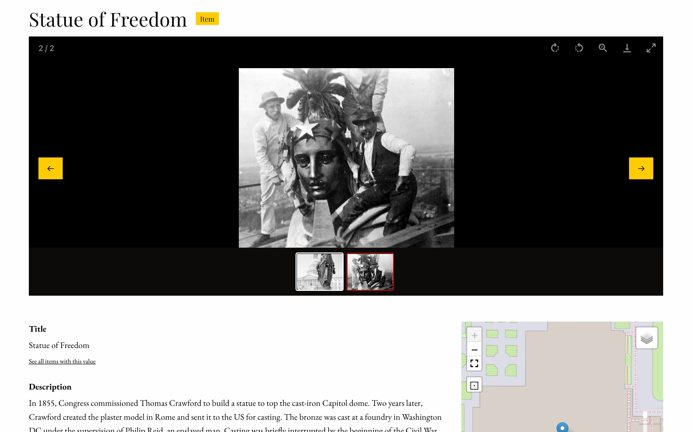
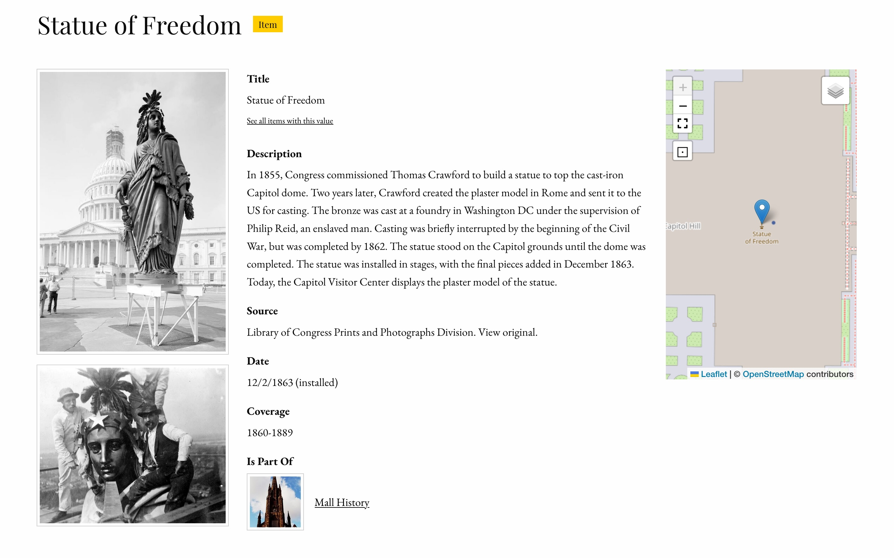
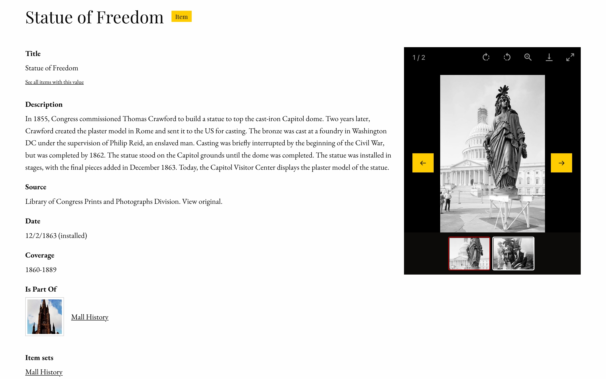

# Foundation S

University of Manchester branded Omeka S theme based on ZURB Foundation Sites, designed for use with Agile Humanities's/Dartmouth College's Agile Theme Tools: https://github.com/agile-humanities/agile-theme-tools-omeka. The Annona IIIF storyboard feature is enabled https://github.com/NCSU-Libraries/annona, and the theme includes a language selector, optimised for two languages. Elements of code for the language slector have been taken from from Ivy Rose's Multilingual theme: https://github.com/ivyrze/omeka-s-theme-multilingual". It currently comes with a default stylesheet for prototyping as well as 3 other style options. 

## Installation

For basic out-of-the-box use of the theme, follow the [Omeka S User Manual instructions for installing themes](https://omeka.org/s/docs/user-manual/sites/site_theme/#installing-themes). 

For more advanced use, such as customizing the theme with Sass, you'll need to install the tools with [NodeJS](https://nodejs.org/en/) (0.12 or greater). Navigate to your theme directory and run `npm install`.

## Theme Configuration

* **Stylesheet**: The theme provides 4 style options.
  * **Default** uses ZURB Foundation's default styles for prototyping, which are all viewable in their documentation under the [Kitchen Sink](https://get.foundation/sites/docs/kitchen-sink.html).
  * **Revolution** aims to capture the feel of old documents and juxtaposes it with a bright red accent. It includes a textured paper background image.
  * **Sea Foam** offers a clean, friendly look with a teal palette.
  * **Inkwell** features a high contrast serif family for its typography, as well as sunny yellow accents.
* **Navigation layouts**: Global navigation can display as a **horizontal top bar with optional dropdown menus** or a **left vertical column**.
* **Show top navigation child pages**: Toggle display of child pages within the main navigation.
* **Top navigation depth**: If the main navigation is set to display child pages, this setting controls how many navigation levels to display. Setting this to '0' shows all levels.
* **Logo**: Upload an image asset to use as a logo in place of a text site title.
* **Banner**: Upload an image asset to use a banner that sits above the main content area of every view.
* **Banner width**: The maximum banner image width in pixels.
* **Banner height**: The maximum banner image height in pixels.
* **Banner height for mobile devices**: The maximum banner image height in pixels at narrower viewport widths..
* **Banner position**: Where to anchor the banner image within its container: centered, stuck to the top, or stuck to the bottom.
* **Footer content**: Control what appears in the footer. This field takes HTML markup.
* **Layout for browse pages**: Select how to display items within their "browse" views.
  * **Grid**: Items are organized into rows and columns. This is recommended for items that prominently feature images.
  * **List**: Items are stacked into a single column.
  * **Toggle (default: grid)**: Site visitors can choose to display the browse views as grids or lists, and grids are the default.
  * **Toggle (default: list)**: Site visitors can choose to display the browse views as grids or lists, and lists are the default.
* **Metadata layout for show pages**: Resource metadata can show display as **stacked** with properties as headings above their values, or **inline** with properties as headings inline with their values.
* **Media display for show pages**: Options for presenting media on item and media show views. 'Within metadata' shows media in the same column as the metadata. 'Next to metadata' gives media their own column alongside the metadata. 'Full-width media viewer above metadata' enables a gallery view with zoom and pan abilities. This ignores the 'Embed media' site setting.
* **Truncate body property**: Controls the size of the body property of resources in a browseable list. It can be set to show the full value, truncate after 4 lines and fade out, or truncate after 4 lines and clip with an ellipsis.

## Customizing the Theme

For those dipping their toes into customizing sites with CSS, the [CSS Editor](https://omeka.org/s/modules/CSSEditor/) module allows site administrators to write style overrides.

For advanced CSS and Sass users, Foundation S uses ZURB Foundation Site's toolkit that includes variables and mixins for managing and extending many styles.

### Sass Tasks

Run these commands within the theme's root directory.

* **npm start**: While this task runs, it watches for changes to sass files and recompiles the CSS.
* **gulp css**: This is the one-off task for compiling the current Sass/CSS.
* * **gulp css:watch**: This task watches for changes in the Sass, then compiles the CSS.

### Sass File Structure

Foundation S comes with the Default theme, as well as 3 other customized stylesheets that were built on top of Default. The "Sea Foam" theme has the fewest overrides and is thus the easiest reference for a custom theme model.

**/asset/sass/seafoam.scss**

```
@charset 'utf-8';

@import 'globals-default';
@import 'globals-seafoam';
@import 'settings';

// Sea Foam Settings

$topbar-background: $primary-color;
  
$thumbnail-border: 4px solid $secondary-color;
$thumbnail-shadow: none;
$thumbnail-shadow-hover: 0 0 6px 1px rgba($primary-color, 0.5);

$button-background: $secondary-color;
$button-color: $primary-color;

@import 'foundation-core';
@import 'omeka';

header a {
  color: $white;
}
```

Much of the customizability within the theme lies in managing its settings variables. ZURB Foundation's default global variables from their original `_settings.scss` all sit in `_globals-default.scss`. Many of these variables are used throughout the rest of `_settings.scss`, so it was necessary to separate them out into their own file if the theme writer wants to set their own global variables. Here all the overrides live in `_globals-seafoam.scss`, and so all overridden values will be appropriately updated for use throughout the rest of `_settings.scss`. 

Any non-global setting variable overrides should come after the import for `_settings.scss` and before their usagee in the rule files, `_foundation-core.scss`, and `_omeka.scss`. 

ZURB Foundation's default style rules are all managed in `_foundation-core.scss`. All style rules specific to Omeka S are contained within `_omeka.scss`.

After all those imports come all style rules specific to the theme.

## Page and Block Templates

The Omeka S 4.1 introduced the block templates feature, which allows theme developers to provide their users with alternative versions of page blocks. Foundation includes the following templates for each block:

* Asset
  * **Card**: Uses [Foundation Framework's card container](https://get.foundation/sites/docs/card.html) styles.
  * **Media object**: Uses [Foundation Framework's media object container](https://get.foundation/sites/docs/media-object.html) styles.
* Browse preview
  * **List**: Ignores theme setting for browse view layouts and displays all resources as a single column list.
  * **Grid**: Ignores theme setting for browse view layouts and displays all resources in a grid that maxes out at 4 columns.
  * **Toggle (default: list)**: Ignores theme setting for browse view layouts and lets the user choose their browse style, defaulting to a single column list of resources.
  * **Toggle (default: grid)**: Ignores theme setting for browse view layouts and lets the user choose their browse style, defaulting to a grid of resources maxing out at 4 columns.
* Item with metadata
  * **Large media left**: A 2-column layout with the item media rendered to the left of the metadata.
  * **Large media right**: A 2-column layout with the item media rendered to the right of the metadata.
* List of pages
  * **With container**: Provides a gray box container.
* List of sites
  * **Card**: Uses [Foundation Framework's card container](https://get.foundation/sites/docs/card.html) styles for each site.
* Page title
  * **Accent**: Renders the page title with the theme's primary color as a background color.

## Resource Page Configuration

Omeka S 4.0 introduced configurable resource pages. Foundation supports block configuration for items, item sets, and media show pages. Each of those views contains 4 configurable regions:

* **Full-width main**: This is intended to be a primary content area that spans the full width of a page.
* **Main with sidebar**: This is a version of the primary content area that expects to sit alongside one or two sidebars.
* **Right sidebar**: This is a sidebar that sits to the right of "main with sidebar".
* **Left sidebar**: This is a sidebar that sits to the left of "main with sidebar". 

Some examples of how these regions can be used:


Full-width main, main with sidebar, and right sidebar


Left sidebar,  main with sidebar, right sidebar


Main with sidebar, right sidebar

## Copyright
Foundation S is Copyright © 2020-present Corporation for Digital Scholarship, Vienna, Virginia, USA http://digitalscholar.org

The Corporation for Digital Scholarship distributes the Omeka source code
under the GNU General Public License, version 3 (GPLv3). The full text
of this license is given in the license file.

The Omeka name is a registered trademark of the Corporation for Digital Scholarship.

Third-party copyright in this distribution is noted where applicable.

All rights not expressly granted are reserved.